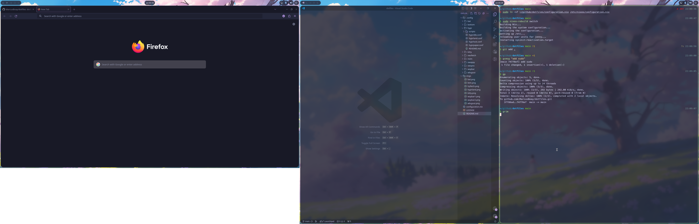

# dotfiles
dotfiles for my NixOS system. This was initially set up for Hyprland and KDE Plasma.



## Setup
At the root of this repo, run:
```bash
stow -t ~/.config .config
sudo ln -sf ~/github/dotfiles/configuration.nix /etc/nixos/configuration.nix
```

## TODO
- [ ] wlogout: `loginctl terminate-user $USER` crashes hyprland...
- [ ] hyprland: don't point `polkit-kde-authentication-agent-1` nix store
- [ ] hyprland: put colors into separate config file